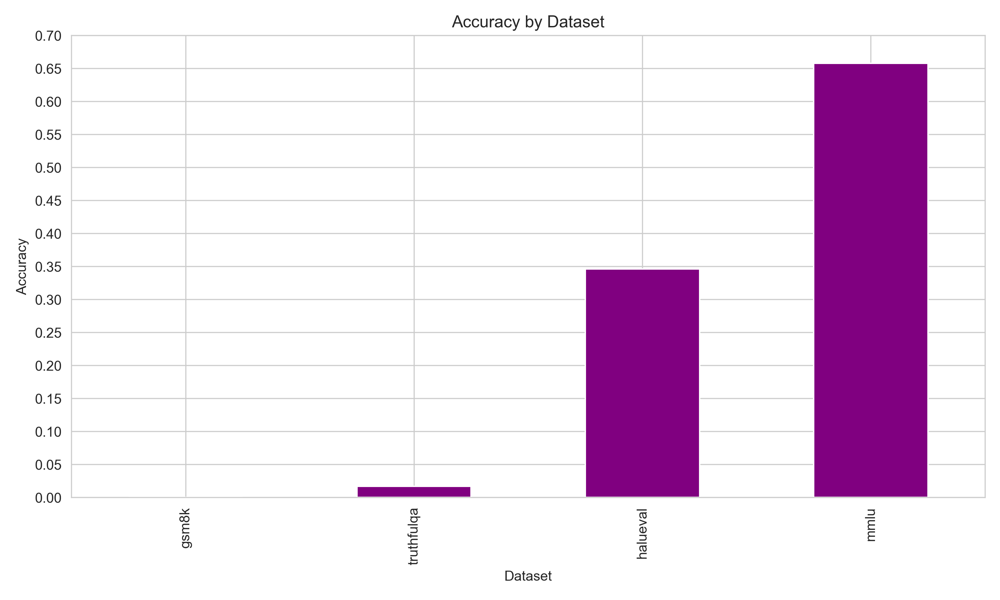
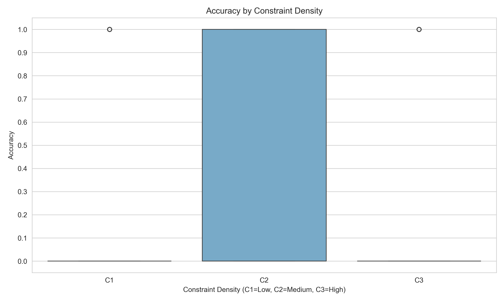
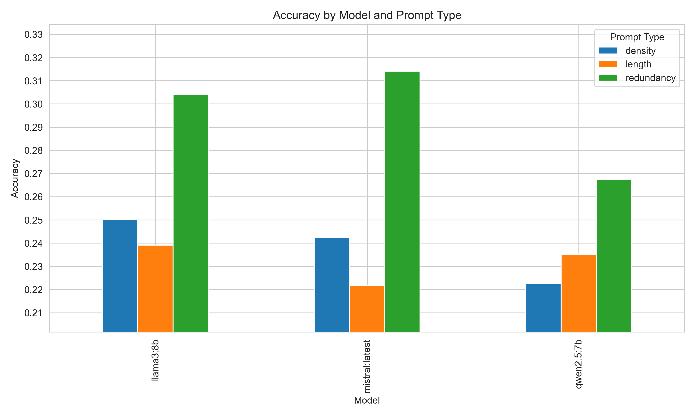
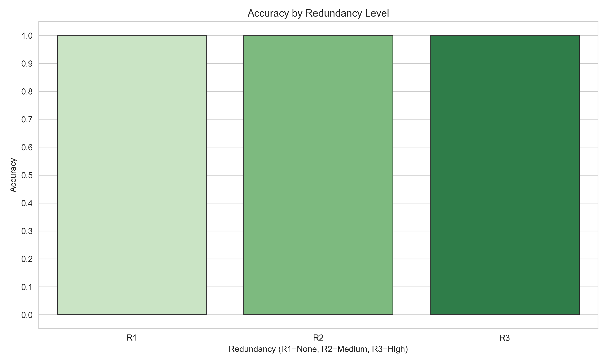
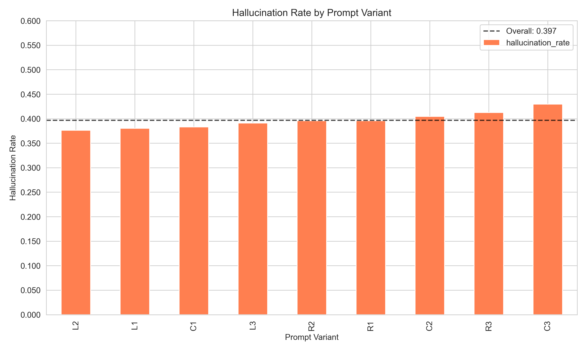
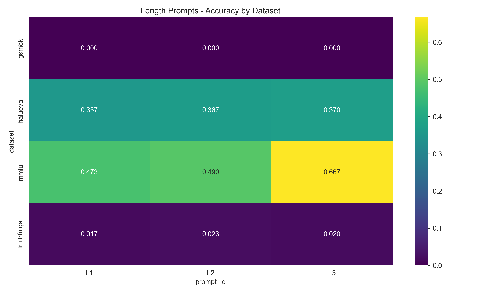

# Prompt Research

An experimental study on how prompt length, redundancy, and constraint density affect LLM factual accuracy, hallucination rate, and prompt compliance. The project includes the full experiment pipeline, analysis scripts, statistical testing, generated figures, and a human validation report.

## Overview

This repository reproduces the complete workflow used in the prompt engineering study:

1. Sample benchmark questions from four datasets.
2. Generate responses from three LLMs across nine prompt variants.
3. Score responses with an NLI-based hallucination detector and accuracy heuristics.
4. Aggregate results into CSV and JSON summaries.
5. Run statistical tests and generate publication-style figures.
6. Document the prompt validation process and survey results.

The final run contains 10,800 generated responses and the derived analysis artifacts under `outputs/`.

## Repository Structure

```text
prompt_research/
├── config.yaml
├── requirements.txt
├── README.md
├── datasets/
│   └── prepare_datasets.py
├── prompts/
│   ├── density_variants.json
│   ├── length_variants.json
│   └── redundancy_variants.json
├── src/
│   ├── analyze_results.py
│   ├── api_clients.py
│   ├── evaluation.py
│   ├── generate_figures.py
│   ├── ollama_client.py
│   ├── run_experiment.py
│   ├── schemas.py
│   └── statistics.py
├── survey/
│   ├── responses.csv
│   └── validation_report.md
└── outputs/
	├── raw_responses/
	│   ├── results.json
	│   ├── results_with_metrics.csv
	│   └── results_with_metrics.json
	├── metrics/
	│   ├── overall.csv
	│   ├── by_model.csv
	│   ├── by_dataset.csv
	│   ├── by_prompt_type.csv
	│   ├── by_prompt_id.csv
	│   ├── cross_model_prompt.csv
	│   └── statistics/
	│       ├── paired_ttests.csv
	│       └── anova.csv
	└── figures/
		├── accuracy_by_model_prompt.png
		├── hallucination_by_prompt.png
		├── accuracy_by_density.png
		├── accuracy_by_redundancy.png
		├── accuracy_by_dataset.png
		└── length_accuracy_heatmap.png
```

### What each folder contains

- `datasets/`: helpers for preparing benchmark subsets.
- `prompts/`: prompt templates grouped by experimental factor.
- `src/`: all experiment, evaluation, statistics, and plotting code.
- `outputs/raw_responses/`: generated model responses and enriched results.
- `outputs/metrics/`: aggregated metric tables used in the report.
- `outputs/metrics/statistics/`: paired t-tests and ANOVA outputs.
- `outputs/figures/`: all plots used in the report.
- `survey/`: validation questionnaire data and the final validation report.

## Experimental Design

The study evaluates three prompt dimensions:

- Length: `L1`, `L2`, `L3`
- Redundancy: `R1`, `R2`, `R3`
- Constraint density: `C1`, `C2`, `C3`

Each dimension is tested across three local models:

- `llama3:8b`
- `mistral:latest`
- `qwen2.5:7b`

The pipeline uses four datasets:

- `mmlu`
- `gsm8k`
- `truthfulqa`
- `halueval`

The current configuration samples 100 questions per dataset, which yields 10,800 total responses across the 3 models × 4 datasets × 9 prompt variants design.

## Key Outputs

The repository already contains the final experiment artifacts:

- `outputs/raw_responses/results.json`: raw generated responses.
- `outputs/raw_responses/results_with_metrics.json`: raw responses plus computed metrics.
- `outputs/raw_responses/results_with_metrics.csv`: tabular analysis-ready dataset.
- `outputs/metrics/*.csv`: summary tables for overall, model, dataset, prompt-type, and prompt-id views.
- `outputs/metrics/statistics/*.csv`: paired t-tests and ANOVA results.
- `outputs/figures/*.png`: generated figures for the report.

## Figures

The main figures are embedded below and are stored in `outputs/figures/`.

### Accuracy by Dataset



### Accuracy by Constraint Density



### Accuracy by Model and Prompt Type



### Accuracy by Redundancy Level



### Hallucination Rate by Prompt Variant



### Length Prompt Accuracy Heatmap



## Results Summary

The final analysis reported the following headline metrics:

| Metric                  |       Value |
| ----------------------- | ----------: |
| Total responses         |      10,800 |
| Accuracy                |      0.2552 |
| Hallucination rate      |      0.3966 |
| Average response length | 122.0 words |

### By Model

| Model            | Accuracy | Hallucination rate | Average length |
| ---------------- | -------: | -----------------: | -------------: |
| `llama3:8b`      |   0.2644 |             0.3997 |          127.3 |
| `mistral:latest` |   0.2594 |             0.4085 |          107.0 |
| `qwen2.5:7b`     |   0.2417 |             0.3817 |          131.6 |

### By Dataset

| Dataset      | Accuracy | Hallucination rate | Average length |
| ------------ | -------: | -----------------: | -------------: |
| `gsm8k`      |   0.0000 |             0.4139 |          129.5 |
| `halueval`   |   0.3459 |             0.4433 |           85.8 |
| `mmlu`       |   0.6578 |             0.3472 |          137.1 |
| `truthfulqa` |   0.0170 |             0.3822 |          135.5 |

### By Prompt Type

| Prompt type  | Accuracy | Hallucination rate | Average length |
| ------------ | -------: | -----------------: | -------------: |
| `density`    |   0.2383 |             0.4059 |          101.7 |
| `length`     |   0.2319 |             0.3826 |          129.5 |
| `redundancy` |   0.2953 |             0.4014 |          134.7 |

### By Prompt Variant

| Prompt | Accuracy | Hallucination rate | Average length |
| ------ | -------: | -----------------: | -------------: |
| `C1`   |   0.2125 |             0.3833 |          104.8 |
| `C2`   |   0.2675 |             0.4046 |          125.9 |
| `C3`   |   0.2350 |             0.4297 |           74.2 |
| `L1`   |   0.2117 |             0.3804 |          109.6 |
| `L2`   |   0.2200 |             0.3765 |          113.7 |
| `L3`   |   0.2642 |             0.3910 |          165.3 |
| `R1`   |   0.2967 |             0.3958 |          134.0 |
| `R2`   |   0.2917 |             0.3957 |          134.9 |
| `R3`   |   0.2975 |             0.4126 |          135.3 |

## Methodology

### Data Collection

The experiment driver is `src/run_experiment.py`. It loads `config.yaml`, iterates over datasets, models, prompt types, and prompt variants, then writes one response record per question to `outputs/raw_responses/results.json`.

The run is resumable: if `results.json` already exists, the script skips entries already completed.

### Metric Computation

`src/analyze_results.py` loads the raw responses, computes metrics using `src/evaluation.py`, and writes:

- `outputs/raw_responses/results_with_metrics.json`
- `outputs/raw_responses/results_with_metrics.csv`
- summary tables in `outputs/metrics/`
- statistical tests in `outputs/metrics/statistics/`

### Hallucination Detection

Hallucination scoring is NLI-based rather than heuristic. The evaluation module uses an MNLI-style model to estimate contradiction/entailment signals and convert them into a hallucination rate.

### Statistical Testing

`src/statistics.py` provides:

- paired t-tests
- ANOVA
- effect-size calculations
- p-value heatmaps

`src/generate_figures.py` uses the summary CSVs to create the figures stored in `outputs/figures/`.

## Environment Requirements

- Python 3.14
- A virtual environment is strongly recommended
- Local Ollama models for generation
- Internet access for first-time download of Hugging Face evaluation models

### Python Dependencies

Install everything listed in `requirements.txt`:

- `pandas`
- `numpy`
- `scipy`
- `statsmodels`
- `seaborn`
- `matplotlib`
- `scikit-learn`
- `transformers`
- `torch`
- `pyyaml`
- `tqdm`
- and the API/client utilities used by the generation scripts

## Setup

```bash
git clone https://github.com/aminsaidane/prompt_research.git
cd prompt_research
python -m venv venv
source venv/bin/activate
pip install -r requirements.txt
```

If you use macOS or Linux, the activation command above is correct. On Windows PowerShell, use `venv\\Scripts\\Activate.ps1`.

## Reproduction Instructions

### 1. Prepare datasets

The repository already includes dataset subsets. If you need to regenerate them, use:

```bash
python datasets/prepare_datasets.py
```

### 2. Run the experiment

```bash
python src/run_experiment.py
```

This step generates raw responses and writes them to `outputs/raw_responses/results.json`.

### 3. Compute metrics and summaries

```bash
python src/analyze_results.py
```

This produces the enriched response tables and summary CSVs.

### 4. Generate figures

```bash
python src/generate_figures.py
```

This regenerates all PNG figures under `outputs/figures/`.

### 5. Review statistical outputs

After the analysis step completes, inspect:

- `outputs/metrics/overall.csv`
- `outputs/metrics/by_model.csv`
- `outputs/metrics/by_dataset.csv`
- `outputs/metrics/by_prompt_type.csv`
- `outputs/metrics/by_prompt_id.csv`
- `outputs/metrics/cross_model_prompt.csv`
- `outputs/metrics/statistics/paired_ttests.csv`
- `outputs/metrics/statistics/anova.csv`

## Reproducibility Notes

- The experiment uses `temperature: 0.0` for deterministic generation.
- The dataset sampling seed is fixed in `config.yaml`.
- The analysis pipeline is resumable and writes incrementally.
- The NLI evaluation model is downloaded on first use.
- The local model names in `config.yaml` must match your Ollama installation.

## Validation Report

The human validation study is documented in `survey/validation_report.md` and supported by `survey/responses.csv`.

That report contains:

- respondent demographics
- length, redundancy, and density validation results
- preference summaries
- the complete Section 9 results table
- appendices with prompt templates, questionnaire items, raw samples, and code snippets

## Troubleshooting

- If `python src/run_experiment.py` fails with a missing module error, make sure the virtual environment is active and dependencies are installed.
- If the evaluation step is slow, the NLI model is the bottleneck. CPU execution is possible but may take a long time on 10,800 rows.
- If `seaborn` or `matplotlib` import errors mention `statistics`, ensure you are running the scripts from the repository root so the local module resolution behaves as expected.
- If Ollama generation fails, confirm the target model names in `config.yaml` exist locally.

## Suggested Citation

If you use this repository in your work, cite the project and describe the prompt engineering setup, datasets, and NLI-based evaluation pipeline.

## License

No explicit license file is included in the repository snapshot. Check with the repository owner before redistributing or reusing the material outside this project.
